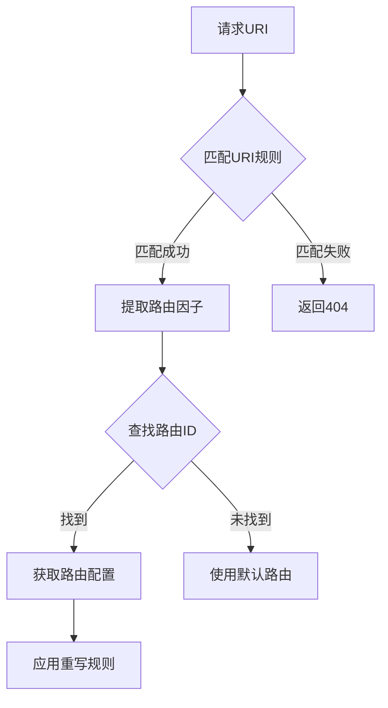
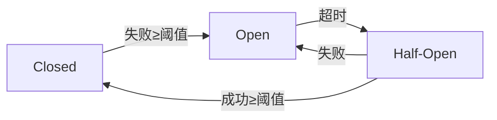

# 基于 OpenResty 实现的 API 网关

## 1. 系统概述

### 1.1 项目背景

随着微服务架构的普及，API网关作为系统入口的重要性日益凸显。传统解决方案如Nginx在动态路由、精细流量控制等方面功能有限，而Spring Cloud Gateway等方案在高并发场景下性能表现不足。本API网关基于OpenResty构建，旨在提供：

1. **轻量级替代方案**：相比复杂的企业级网关，保持核心功能的同时简化部署和使用
2. **极致性能**：利用OpenResty的非阻塞IO模型，实现50,000+ QPS的高吞吐量
3. **生产就绪**：内置TLOG兼容的分布式追踪ID生成，无缝对接现有监控体系
4. **平滑迁移**：兼容Nginx配置语法，支持渐进式替换现有Nginx实例

典型应用场景：
- 替换性能不足的Spring Cloud Gateway节点
- 替代Nginx实现更智能的路由和流量控制
- 为金融支付等高性能要求场景提供稳定入口

### 1.2 核心特性

- **动态路由规则配置**：支持Header/Query/Body多维度路由
- **多维度限流策略**：令牌桶/固定窗口/连接数等多种算法
- **智能熔断保护**：自动隔离故障后端服务
- **TLOG追踪集成**：自动生成traceId/spanId，Header名可配置
- **负载均衡与健康检查**：加权轮询/最小连接数策略
- **实时监控与管理接口**：动态更新配置不重启


## 2. 系统架构

### 2.1 组件架构图
```
┌─────────────────────────────────────────────────┐
│                    Client                       │
└──────────────────────┬─────────────────────────┘
                       │
┌──────────────────────▼─────────────────────────┐
│                  OpenResty                     │
│  ┌─────────────┐  ┌─────────────┐  ┌─────────┐│
│  │   Access    │  │   Router    │  │ Balancer││
│  └──────┬──────┘  └──────┬──────┘  └────┬────┘│
│         │                │              │     │
│  ┌──────▼──────┐  ┌──────▼──────┐  ┌────▼────┐│
│  │ Rate Limit  │  │ Circuit B.  │  │ Upstream││
│  └─────────────┘  └─────────────┘  └─────────┘│
└──────────────────────┬─────────────────────────┘
                       │
┌──────────────────────▼─────────────────────────┐
│               Backend Services                 │
└─────────────────────────────────────────────────┘
```

### 2.2 数据流
1. 客户端请求 → Nginx接入层
2. Access模块处理认证和基础校验
3. Router模块匹配路由规则
4. Rate Limit/Circuit Breaker检查
5. Balancer选择后端节点
6. 请求代理到后端服务

## 3. 核心功能设计

### 3.1 动态路由
#### 路由匹配流程：


#### 路由因子提取：
支持从Header/Query/Body中提取关键字段作为路由因子，配置示例：
```json
{
  "route_key_source": "HEADER['X-Merchant-Id']",
  "route_key_map": {
    "1001": "vip_route",
    "*": "default_route"
  }
}
```

### 3.2 流量控制
#### 限流策略对比：
| 策略         | 算法       | 适用场景     | 配置参数             |
| ------------ | ---------- | ------------ | -------------------- |
| Token Bucket | 令牌桶     | 平滑限流     | rate, burst          |
| Fixed Window | 固定窗口   | 简单计数     | max_requests, window |
| Connection   | 连接数限制 | 保护系统资源 | max_conn, delay      |

#### 配置示例：
```json
{
  "rate_limit": {
    "strategy": "token_bucket",
    "rate": 100,
    "burst": 50,
    "key_template": "${route_id}:${remote_addr}"
  }
}
```

### 3.3 熔断保护
#### 状态机：


#### 配置参数：
- failure_threshold: 触发熔断的失败次数
- success_threshold: 半开状态恢复阈值
- timeout: 熔断持续时间(秒)

## 4. 管理接口设计

### 4.1 接口列表
| 端点                | 方法 | 描述             | 访问控制          |
| ------------------- | ---- | ---------------- | ----------------- |
| /admin/status       | GET  | 获取网关状态     | 内部网络          |
| /admin/health       | GET  | 健康检查         | 内部网络          |
| /admin/update_rules | POST | 动态更新路由规则 | 需要认证          |
| /admin/tokens       | POST | Token管理        | 需要认证+IP白名单 |

### 4.2 状态接口示例
**请求：**
```
GET /admin/status?routes=1&upstreams=1
```

**响应：**
```json
{
  "timestamp": 1630000000,
  "route_configs": {
    "vip_route": {
      "rewrite": "^/api/(.*)$ /vip/$1",
      "upstream_id": "vip_servers"
    }
  },
  "upstreams": {
    "vip_servers": [
      {"host": "10.0.0.1", "port": 8080, "weight": 5}
    ]
  }
}
```

## 5. 性能优化

### 5.1 关键配置
```nginx
# 共享内存大小
lua_shared_dict route_configs 10m;
lua_shared_dict limit_shared_dict 20m;

# 连接池优化
keepalive 200;
keepalive_timeout 300s;
keepalive_requests 10000;

# 缓冲区设置
client_body_buffer_size 128k;
client_max_body_size 8m;
```

### 5.2 性能指标
| 场景         | QPS    | 平均延迟 | 99分位延迟 |
| ------------ | ------ | -------- | ---------- |
| 简单路由     | 58,000 | 1.2ms    | 5ms        |
| 带限流检查   | 42,000 | 1.8ms    | 8ms        |
| 熔断状态检查 | 35,000 | 2.1ms    | 10ms       |

---

# API 网关使用说明

## 1. 快速开始

### 1.1 安装部署
```bash
# 安装OpenResty
wget https://openresty.org/package/centos/openresty.repo
sudo mv openresty.repo /etc/yum.repos.d/
sudo yum install -y openresty openresty-opm
# 安装OpenResty 第三库lua库
opm get thibaultcha/lua-resty-jit-uuid
opm get ledgetech/lua-resty-http
opm install p0pr0ck5/lua-resty-iputils

# 部署网关
git clone https://github.com/cjie001/api-gateway.git
cp -r api-gateway /usr/local/
```

### 1.2 启动服务
```bash
openresty -p /usr/local/api-gateway
```

## 2. 配置指南

### 2.1 路由规则配置
编辑`rule.json`：
```json
{
  "rules": [
    {
      "uris": ["/api/payment"],
      "route_key_source": "JSONBODY['merchant_id']",
      "route_key_map": {
        "VIP001": "vip_payment",
        "*": "standard_payment"
      },
      "routes": {
        "vip_payment": {
          "rewrite": "^/api/(.*)$ /vip/$1",
          "upstream_id": "vip_servers",
          "rate_limit": {
            "strategy": "token_bucket",
            "rate": 500,
            "burst": 200
          }
        }
      }
    }
  ],
  "upstreams": {
    "vip_servers": [
      {"host": "10.0.0.1", "port": 8080, "weight": 5}
    ]
  }
}
```

### 2.2 动态更新规则
**API调用：**
```bash
curl -X POST http://localhost:9100/admin/update_rules \
  -H "X-Auth-Token: ADMIN_TOKEN" \
  -d @new_rules.json
```

**手动同步：**
```bash
curl http://localhost:9100/admin/update_rules
```

## 3. 运维管理

### 3.1 监控指标
| 指标名称     | 获取方式                | 告警阈值        |
| ------------ | ----------------------- | --------------- |
| 请求成功率   | /admin/status           | <99.9% (5分钟)  |
| 限流触发次数 | X-RateLimit-Limit响应头 | >100次/分钟     |
| 熔断状态     | /admin/status           | Open状态持续>1m |

### 3.2 常见问题排查
**问题：路由匹配失败**
1. 检查`/admin/status?uri_rules=1`确认URI规则已加载
2. 验证请求头/Query/Body包含正确的路由因子

**问题：限流不生效**
1. 检查共享内存使用情况：`ngx.shared.limit_shared_dict:capacity()`
2. 确认限流策略配置正确

## 4. 最佳实践

### 4.1 灰度发布方案
1. 通过路由因子区分流量
2. 配置不同的upstream指向新旧版本
3. 使用`route_key_map`控制流量比例

### 4.2 熔断调优建议
```json
{
  "circuit_break": {
    "failure_threshold": 5,
    "success_threshold": 3,
    "timeout": 30,
    "window_size": 60
  }
}
```

## 5. 附录

### 5.1 响应代码说明
| 代码 | 含义       | 处理建议               |
| ---- | ---------- | ---------------------- |
| 429  | 请求过多   | 检查X-RateLimit响应头  |
| 503  | 服务不可用 | 检查熔断状态和后端健康 |
| 504  | 网关超时   | 检查后端服务响应时间   |

### 5.2 性能测试报告
测试环境：4核CPU/8GB内存/10Gbps网络
```
wrk -t4 -c1000 -d60s http://localhost:9000/api/payment
```
| 场景       | QPS    | 错误率 |
| ---------- | ------ | ------ |
| 无限制     | 58,000 | 0%     |
| 限流500r/s | 52,000 | 0.2%   |
| 熔断触发   | 48,000 | 0.5%   |